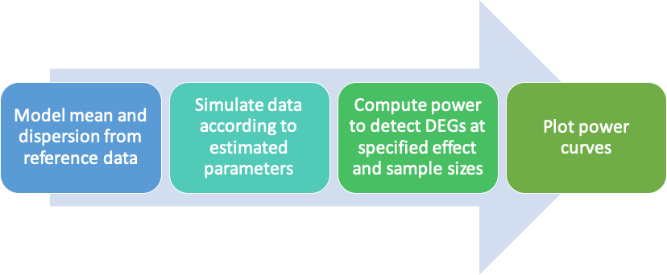

# sc-power-analysis
A snakemake pipeline for scRNA-seq power analyses. 

# Introduction
This pipeline estimates power to detect differentially expressed genes from scRNA-seq data at various numbers of samples/cells and effect sizes. It models mean and dispersion parameters on a Negative Binomial distribution from reference data and simulates representative UMI count data from these estimates. The user can define various simulation parameters, such as the number of differentially expressed genes, effect sizes, number of samples, and number of cells. 
<p align="center">

</p>

# Download
Clone the repository to your desired destination.
```Shell
git clone https://github.com/zrcjessica/sc-power-analysis.git
```
# Dependencies
This pipeline was written with snakemake version 5.20.1. We recommend that you follow these instructions for [snakemake installation via conda](https://snakemake.readthedocs.io/en/stable/getting_started/installation.html#installation-via-conda). This will install snakemake in an isolated environment, which is the recommended best practice for avoiding package conflicts. This allows you to [use the `--use-conda` flag](https://snakemake.readthedocs.io/en/stable/snakefiles/deployment.html#integrated-package-management) when running the pipeline, which will automatically install the package specified in the `environment.yml` file. If you do not install snakemake in an isolated environment, then make sure you have installed all of the conda packages listed in `environment.yml`. 

# Execution

All input parameters are defined in the `config.yml` file, and must be edited accordingly to suit your own data. 

## Inputs

